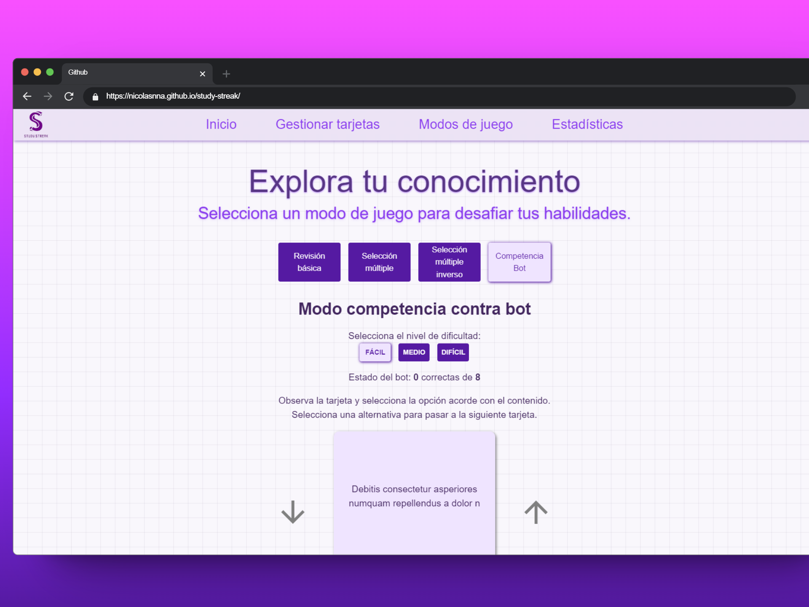

<h1 align="center">
    
</h1>

<h1 align="center">
  <a href="#"> Study Streak </a> 
</h1>

<div align="center">
  
</div>

<p align="center">
 <a href="#acerca-de">Acerca de</a> •
 <a href="#caracteristicas">Caracteristicas</a> •
 <a href="#despliegue-local">Despliegue local</a> • 
 <a href="#tech-stack">Tech Stack</a> •  
 <a href="#author">Author</a> • 
 <a href="#user-content-license">License</a>
</p>

## Acerca de

Aplicación web diseñada para gamificar el estudio utilizando flashcards y con distintos modos de juego. Cuenta con un apartado para revisar el resumen de los resultados logrados en cada modo de juego.

## Caracteristicas

- [x] Importa y exporta las flashcards en formato JSON.
- [x] Guardado de estadísticas y flashcard en local.
- [x] 4 modos de juego: revisión básica, selección multiple, selección multiple inverso y competencia contra bot.
- [x] 3 modos de dificultad en el modo contra bots: fácil, medio y difícil, con su respectivo gráfico de resultados.
- [x] Estadísticas de acierto de cada tarjeta por modo de juego.

## Despliegue local

### Pre-requisitos

Antes de empezar, necesitas tener las siguientes herramientas instaladas en tu máquina:

- [Git](https://git-scm.com)
- [Node.js](https://nodejs.org/en/)
- Un editor de código, preferiblemente [VSCode](https://code.visualstudio.com/)

### Instalación y ejecución de la aplicación web

```bash
# Clonar este repositorio
$ git clone https://github.com/nicolasnna/study-streak.git

# Acceder a la carpeta del proyecto en tu terminal
$ cd study-streak

# Instalar las dependencias
$ npm install

# Ejecutar la aplicación en modo desarrollo
$ npm run dev

# La aplicación se abrirá en el puerto: 5173 - ir a http://localhost:5173
```

## Stack Tecnológico

Estas son las herramientas y tecnologías utilizadas para construir el proyecto:

#### **Plataforma** ([React](https://reactjs.org/) + [Javascript](https://developer.mozilla.org/en-US/docs/Web/JavaScript/))

- **[React Router Dom](https://github.com/ReactTraining/react-router/tree/master/packages/react-router-dom)** - Manejo de rutas
- **[React Redux](https://github.com/reduxjs/react-redux)** - Manejo del estado global
- **[Sass](https://github.com/sass/dart-sass)** - Preprocesador CSS
- **[Mui](https://mui.com/)** - Componentes React y iconos
- **[Vite](https://vite.dev/)** - Herramienta de desarrollo frontend

> Mira el archivo [package.json](https://github.com/evelinsteiger/README-template/blob/master/package.json)
